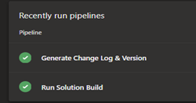
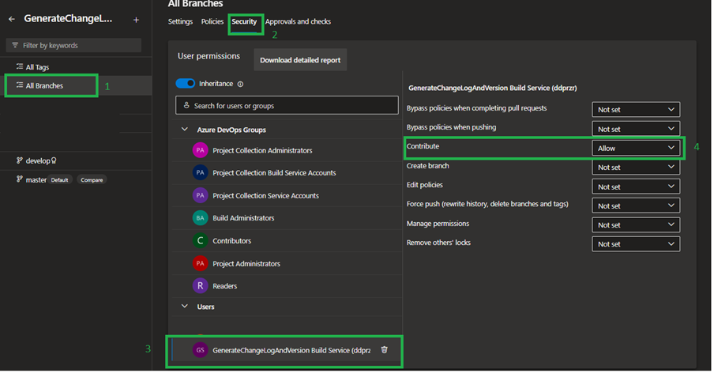
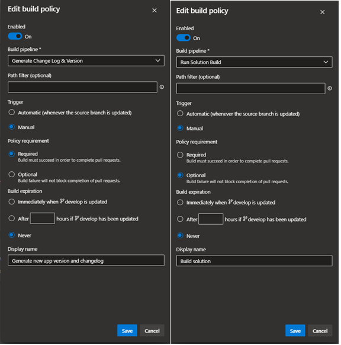
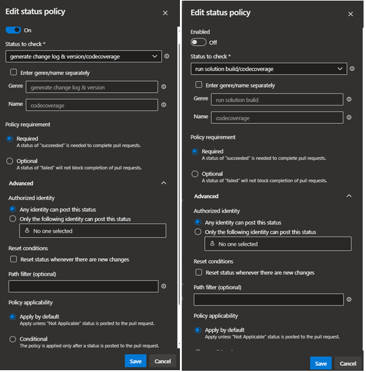
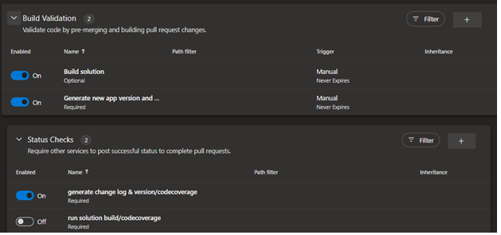
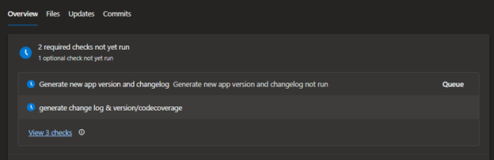
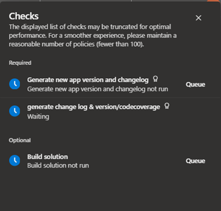
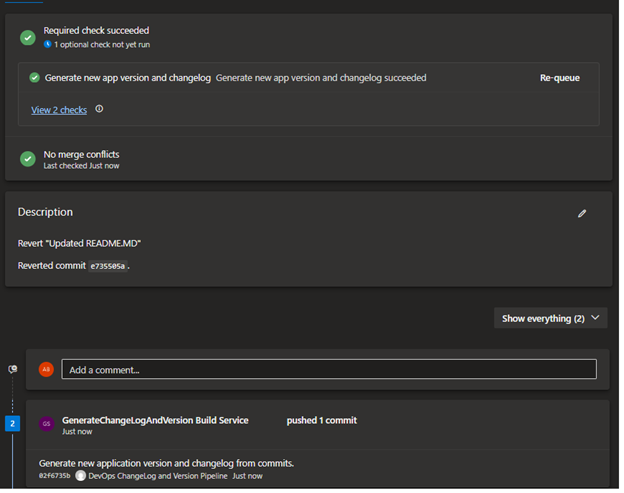
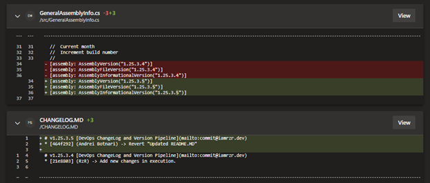

## Generating a version and history of code changes with automation on Azure DevOps.

Every person, as an application developer, a manager, or another member of the development team, but also as a customer of a final product, is interested in being traceable throughout the project/product life cycle. 

To make it clear, we can define some major points as to why an application version is necessary: 
*	Tracking changes and functionalities;
*	Handling errors and debugging the code;
*	Specifying compatibility and dependencies;
*	Communicating with the user/customer;
*	Preparing update packages;
*	Periodic security updates;
*	Product support and maintenance;

In the given context, when I try to say traceability, I mean that every change made, regardless of its purpose, must be associated with a product version. Thus, every adjustment can be tracked. A code or application error can be identified in different situations, significantly reducing the time and resources required for an investigation or debugging of the code, drawing attention and resources only in a narrow direction. Also, application versioning is beneficial when communicating with the customer/user of the product about a new functionality introduced in version X, but surely there are still many reasons why it is beneficial and why it must be implemented in every project.

Next, I would like to present an implementation method that would be the logic followed when generating the version and when executing changes in the code according to the commits. For the demonstration, `PowerShell`, `YAML` and a `C#` project will be used.

First, we need to define how to generate a version. For the given example, `w.x.y.z` will be used, where:
-	**w** -> major version, set manually;
-	**x** -> the current year will be taken at execution
-	**y** -> the current month will be taken at execution;
-	**z** -> it will be incremented by one unit each time at execution and will be reset at the beginning of each month.

*Example: w.x.y.z -> 1.25.3.1, 1.25.3.2, ..., 1.25.4.1*

Once the generation algorithm is generally defined, a script must be written that will execute it each time and will take into account the current version defined in the project.

The project used is one written in `C#`, the version will be defined in the predefined file `AssemblyInfo.cs`; we will create another file `GeneralAssemblyInfo.cs` to be able to use it within a solution for all projects and to have a single version reflected.

The data about the current version is stored in the attributes: `AssemblyVersion`, `AssemblyFileVersion` and `AssemblyInformationalVersion`. Following the generation of a new version, the data should be updated in this file and in the specified attributes.

The file `generate-new-version.ps1` contains the execution code. From the current point, you can run scripts with suppling the required parameters and get a new version of the application. To enhance comfort during usage, you can create a `bat` file and run it every time you need and forget about the required parameters or what is the value that needs to be added to a parameter.

### What about a changelog history that is based on code commits?

Writing relevant, clear and well-structured commit message is crucial for maintaining organized and understandable project history. Every commit message helps team members understand the purpose of change added to project, so it can provided base context information without necessity to open code and examine it. A clear commit can help develop teams to track when some issue appear or was introduced, making code debugging easier, efficient and faster.

To make change log from the commits we need to define the logic, what we need from changelog. In the current example, the following structure is defined:

```markdown
...

# v0.0.0.0 [DevOps ChangeLogVersion](mailto:commit@domain.com)
* [658f59b] (User) -> Update generate changelog pipeline
* [80c37a2] (User) -> Update solution build pipeline

...
```

On generating commit history, I’ll add more logic to simplify number of required action to execute code.

Creating the script file I’ll use also `PoweShell` script and define the following methods: 
*	`Get-CommitMessage` – Get the commit message added by user; 
*	`Get-CommitHash` – Get commit hash; 
*	`Add-ChangeLog` – Add the commit data to changelog file.

Add input parameters to make a more customized request, like 
- application name
- generate new application version
- auto pull the latest version of source/main branch
- auto commit and push data (modification) to origin
- source branch name
- destination branch name
- current execution path (solution path). 

The full code and execution logic are in the `generate-change-log.ps1` file.

In case when you are the only developer or have a small development team (2-3 persons), you can execute the script on your local machine and never mind about some problems. However, every time to open the console and write parameters, it is annoying and boring, so to use efficient time, just create a bat file and apply all parameters there.

In part with `automation` is used `Azure DevOps`. Through automation, I try to make known the chosen method for the given case. It will try to automate the generation of a new version and the generation of the history, but also the solution build.

For both cases, two files will be created: `run_gen_changelog_version.yaml` and `run_solution_build.yaml`. These two files will be integrated to be executed before merging the new feature branch and stable `develop` branch. 

- `run_gen_changelog_version.yaml` – generate new application version, commit history in changelog;
- `run_solution_build.yaml` – build the solution;

Integration will be achieved by implementing policies and blocking completing pull requests. 

### Azure DevOps configuration

#### -	Pipeline configuration
1.	Select you repository, for me is `GenerateChangeLogAndVersion`
2.	Add (import) previous specified yaml file to pipelines and set the pipeline variables. 

For `run_gen_changelog_version.yaml`: *`commit_user_email`* and *`repository_full_path`*. 

For `run_solution_build.yaml`, are a two local variable that must be modified *`solutionPath`* and *`sdkVersion`*.



#### -	Branch build service configuration
1.	Select you repository, for me is `GenerateChangeLogAndVersion`
2.	Access repository branches 
3.	Select the position `All branches`, than go to `Security`, and select `… Build Service` (for me is `GenerateChangeLogAndVersion Build Service`), than for `Contribute` pick `Allow` option.



#### -	Branch policy configuration
1.	Select you repository, for me is `GenerateChangeLogAndVersion`
2.	Access repository branches 
3.	Select `develop` branch and go to `Policies`. 
4.	Here start *`Build Validation`* and *`Status Checks`* configuration. See the images

##### Build Validation


##### Status Checks


As result


#### Pull request 
After all configuration on pull request initiate all policies will be applied and require user action.





After `Queue`, the script with version generate will run and push new changes in current PR.



